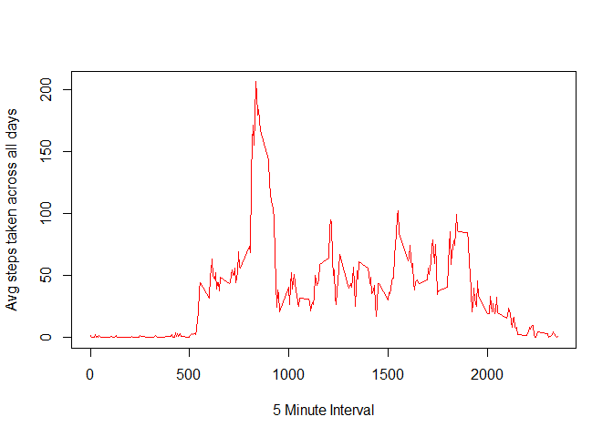

# Reproducible Research - Peer-graded Assignment1


## Introduction
This is a peer-graded assignment1 of Reproducible Research couse.

This assignment makes use of data from a personal activity monitoring device. This device collects data at 5 minute intervals through out the day. The data consists of two months of data from an anonymous individual collected during the months of October and November, 2012 and include the number of steps taken in 5 minute intervals each day.

## Notes
This assignment assumes that a data folder with activity.csv file exists in the current directory.

### Loading libraries needed for the assignment

```r
    library(ggplot2)
    library(dplyr)
    library(lattice)
```


### Loading and preprocessing the data
1. Load the data (i.e. read.csv())

```r
    activity_data <- read.csv("data/activity.csv", header = T, na.strings = "NA")
```
2. Process/transform the data (if necessary) into a format suitable for your analysis

```r
    activity_data$date <- as.Date(activity_data$date)
```

##What is mean total number of steps taken per day?

For this part of the assignment, you can ignore the missing values in the dataset.

```r
    activity_data_complete <- activity_data[complete.cases(activity_data),]
```
1. Calculate the total number of steps taken per day

```r
    total_steps_per_day <- aggregate(steps ~ date, activity_data_complete, sum)
    names(total_steps_per_day) <- c("date", "steps")
```
2. If you do not understand the difference between a histogram and a barplot, research the difference between them. Make a histogram of the total number of steps taken each day

```r
    hist(as.numeric(total_steps_per_day$steps), col = "red", xlab="Total steps per day", breaks = 20, main = "Total Number of steps taken each day")
```

<!-- -->
3. Calculate and report the mean and median of the total number of steps taken per day

```r
    print(mean(total_steps_per_day$steps))
```

```
## [1] 10766.19
```

```r
    print(median(total_steps_per_day$steps))
```

```
## [1] 10765
```
##What is the average daily activity pattern?

1. Make a time series plot (i.e. type = "l") of the 5-minute interval (x-axis) and the average number of steps taken, averaged across all days (y-axis)

```r
        avg_steps_per_interval <- aggregate(activity_data_complete$steps, list(activity_data_complete$interval), FUN="mean")
    names(avg_steps_per_interval) <- c("interval", "steps")
    plot(x=avg_steps_per_interval$interval, y=as.numeric(avg_steps_per_interval$steps), type="l", col="red", xlab = "5 Minute Interval", ylab="Avg steps taken across all days")
```

<!-- -->

2. Which 5-minute interval, on average across all the days in the dataset, contains the maximum number of steps?

```r
    print(avg_steps_per_interval[avg_steps_per_interval$steps == max(avg_steps_per_interval$steps),])
```

```
##     interval    steps
## 104      835 206.1698
```

##Imputing missing values

Note that there are a number of days/intervals where there are missing values (coded as NA). The presence of missing days may introduce bias into some calculations or summaries of the data.

1. Calculate and report the total number of missing values in the dataset (i.e. the total number of rows with NAs)

```r
    print(nrow(activity_data[!complete.cases(activity_data),]))
```

```
## [1] 2304
```
2. Devise a strategy for filling in all of the missing values in the dataset. The strategy does not need to be sophisticated. For example, you could use the mean/median for that day, or the mean for that 5-minute interval, etc.
  * The strategy is to get the mean for that 5-minute interval. The implementation of this strategy is in the next step.

3. Create a new dataset that is equal to the original dataset but with the missing data filled in.

```r
    activity_data_impute <- activity_data %>% group_by(interval) %>% mutate(steps= ifelse(is.na(steps), mean(as.numeric(steps), na.rm=TRUE), as.numeric(steps)))
```
4. Make a histogram of the total number of steps taken each day and Calculate and report the mean and median total number of steps taken per day. 

```r
    total_steps_per_day_impute <- aggregate(steps ~ date, activity_data_impute, sum)
    names(total_steps_per_day_impute) <- c("date", "steps")
    hist(as.numeric(total_steps_per_day_impute$steps), col = "red", xlab="Total steps per day with imputed data", breaks = 20, main="Total Number of steps taken each day")
```

<!-- -->

```r
    print(mean(total_steps_per_day_impute$steps))
```

```
## [1] 10766.19
```

```r
    print(median(total_steps_per_day_impute$steps))
```

```
## [1] 10766.19
```
###Observations


1. Do these values differ from the estimates from the first part of the assignment?  


  * With imputed values, the mean remains the same. But the median increased by 1 point.  
  
  
2. What is the impact of imputing missing data on the estimates of the total daily number of steps?  


  * Imputing the missing data provides more data for the histogram. 
  
  

##Are there differences in activity patterns between weekdays and weekends?

For this part the weekdays() function may be of some help here. Use the dataset with the filled-in missing values for this part.

1. Create a new factor variable in the dataset with two levels - "weekday" and "weekend" indicating whether a given date is a weekday or weekend day.

```r
    activity_data_impute$week <- factor((weekdays(as.Date(activity_data_impute$date)) %in% c("Saturday", "Sunday")), levels=c(TRUE, FALSE), labels=c('weekend', 'weekday')) 
```
2. Make a panel plot containing a time series plot (i.e. type = "l") of the 5-minute interval (x-axis) and the average number of steps taken, averaged across all weekday days or weekend days (y-axis). See the README file in the GitHub repository to see an example of what this plot should look like using simulated data.

```r
    avg_steps_per_interval_week <- aggregate(steps ~ interval + week, activity_data_impute, mean)
    xyplot(avg_steps_per_interval_week$steps ~ avg_steps_per_interval_week$interval | avg_steps_per_interval_week$week,                    layout = c(1, 2), type = "l", 
                    xlab = "Interval", ylab = "Number of steps")    
```

<!-- -->

